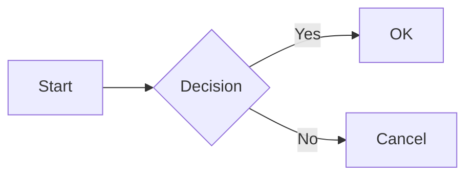
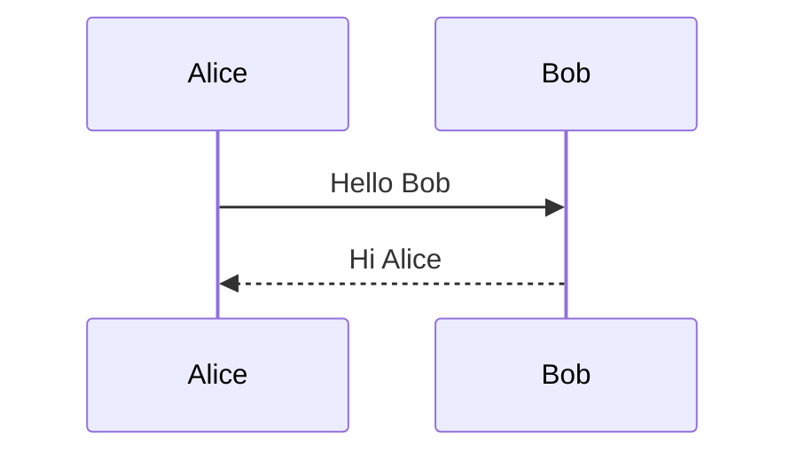

# Mermaid Diagrams

---

## Flowchart

```mermaid
graph LR
    A[Start] --> B{Decision}
    B -->|Yes| C[OK]
    B -->|No| D[Cancel]
```

---

## Sequence Diagram

```mermaid
sequenceDiagram
    Alice->>Bob: Hello Bob
    Bob-->>Alice: Hi Alice
```

---

## Mixed Content

Some text before the diagram.

```mermaid
graph TD
    A --> B
```

And some text after.
