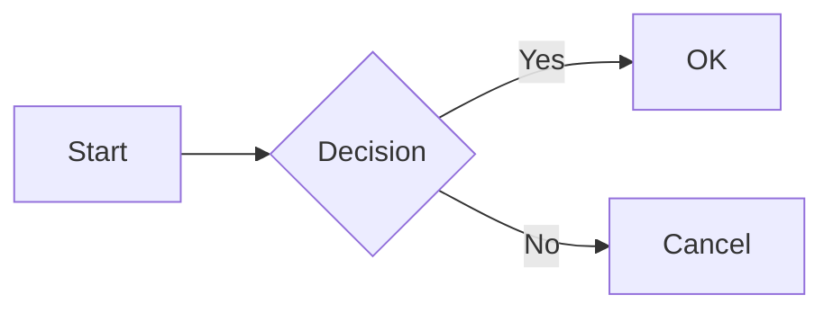
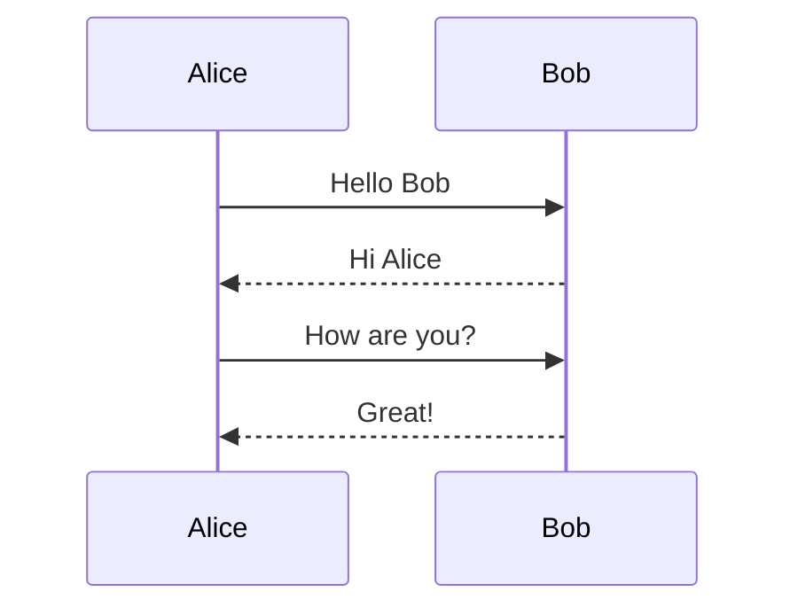
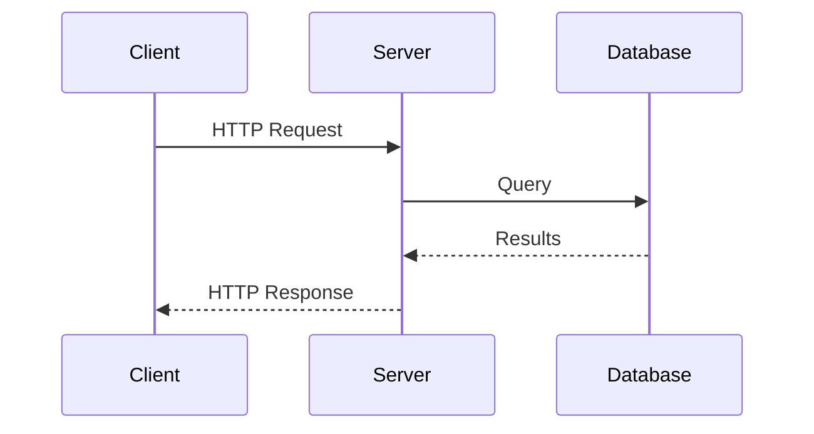
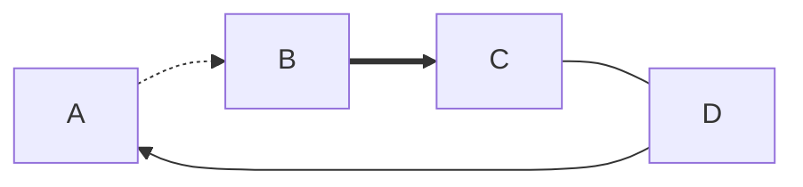

# Mermaid Diagrams

---

## Flowchart (LR)

---

## Flowchart (TD) with Shapes

---

## Sequence Diagram

---

## Sequence with Participants

---

## Dotted and Thick Edges

---

## Mixed Content

Some text before the diagram.

And some text after.
