# Mermaid Diagrams

---

## Flowchart (LR)

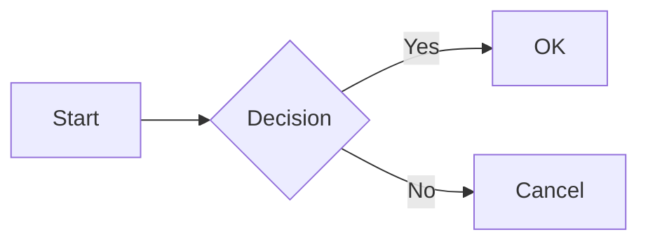

---

## Flowchart (TD) with Shapes

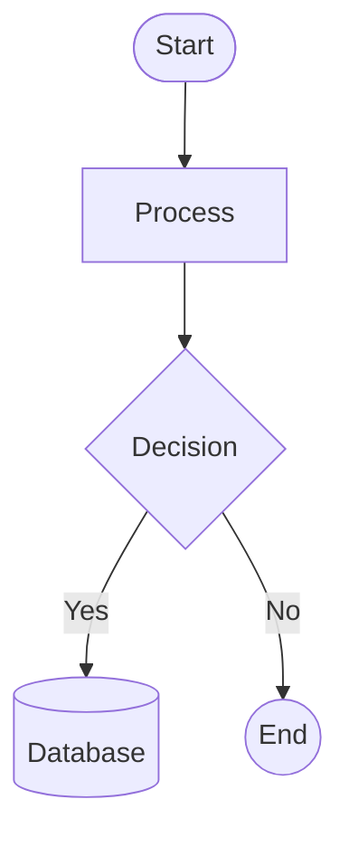

---

## Sequence Diagram

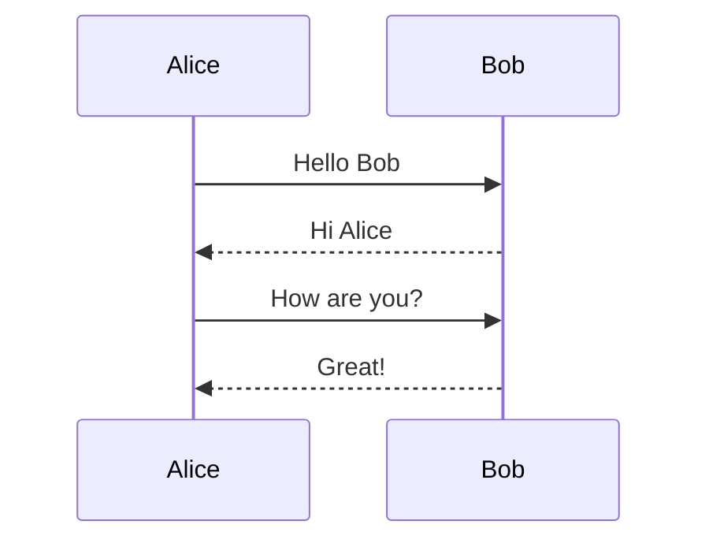

---

## Sequence with Participants

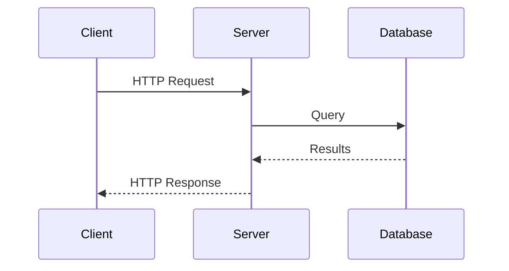

---

## Class Diagram

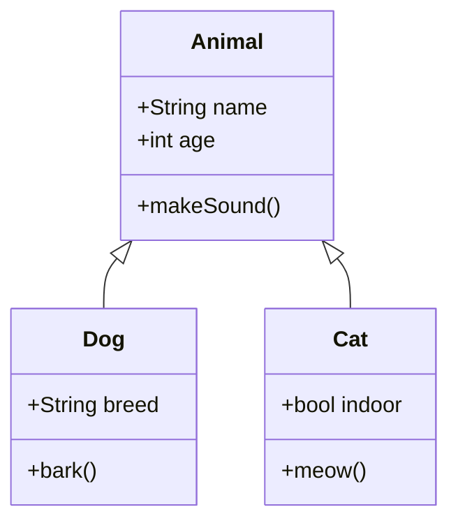

---

## Class Diagram with Relationships

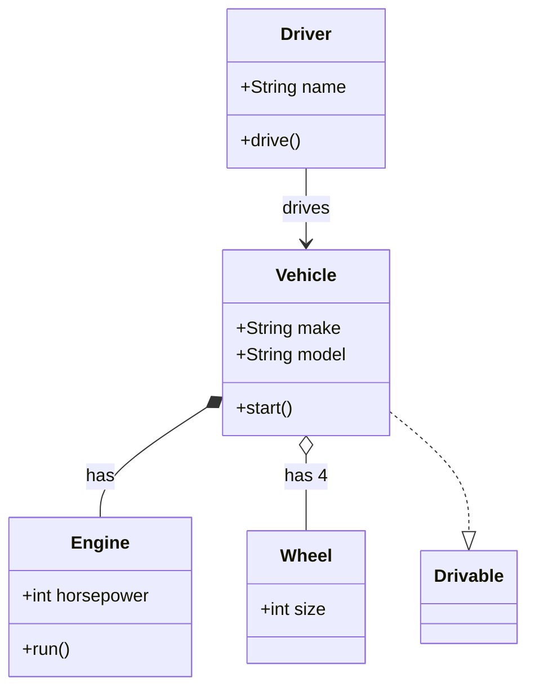

---

## State Diagram

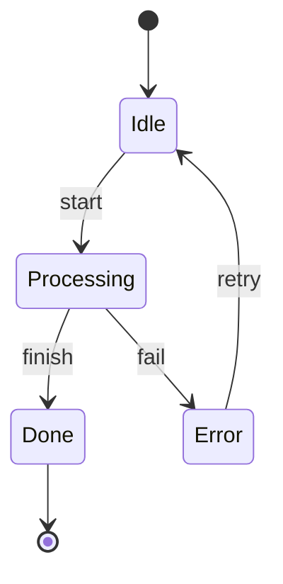

---

## State Diagram (Traffic Light)

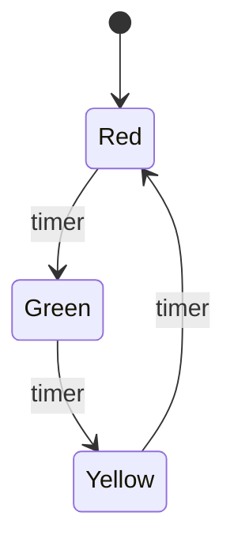

---

## State Diagram (Movement)

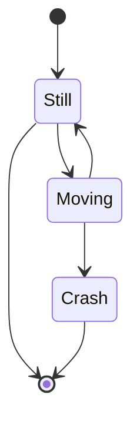

---

## State Diagram (Aliases)

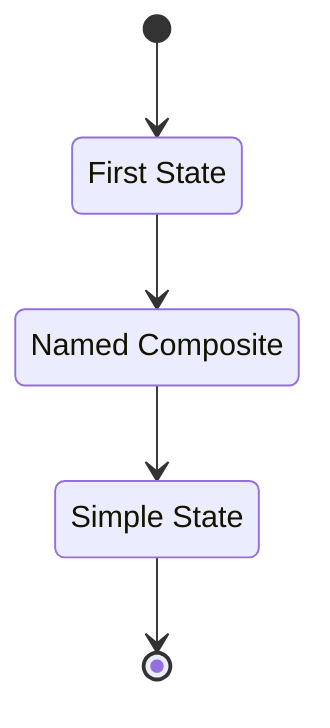

---

## User Journey

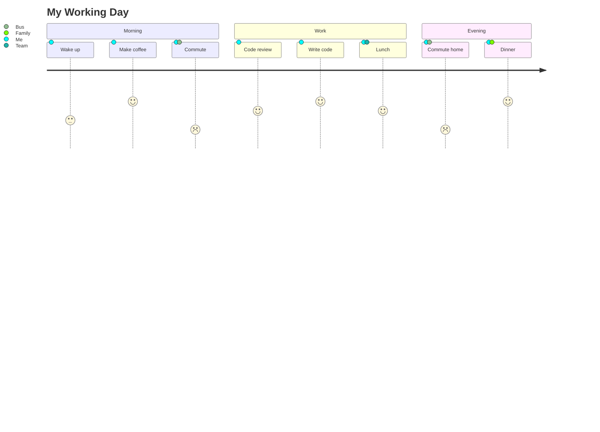

---

## User Journey (Online Shopping)

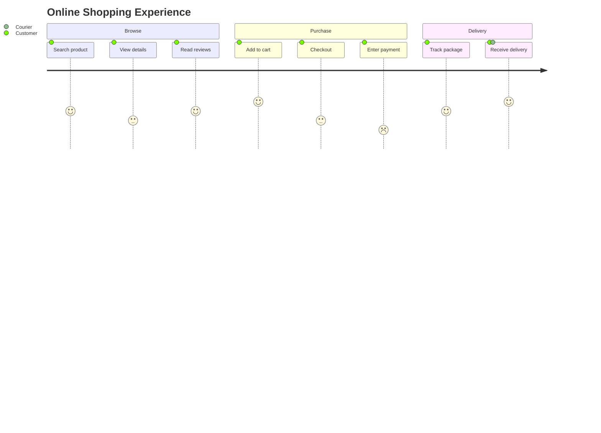

---

## Entity Relationship Diagram

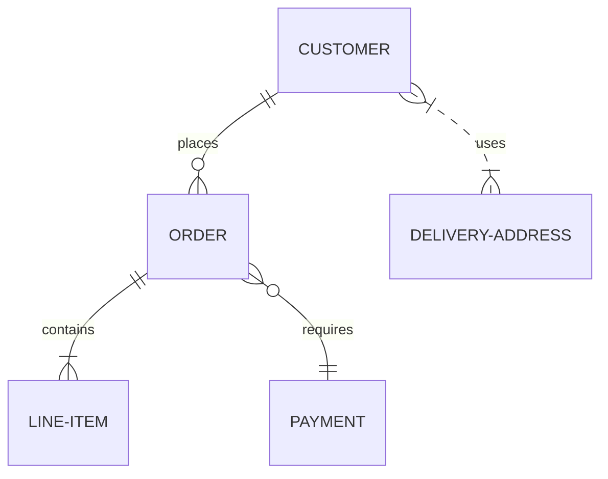

---

## ER Diagram with Attributes

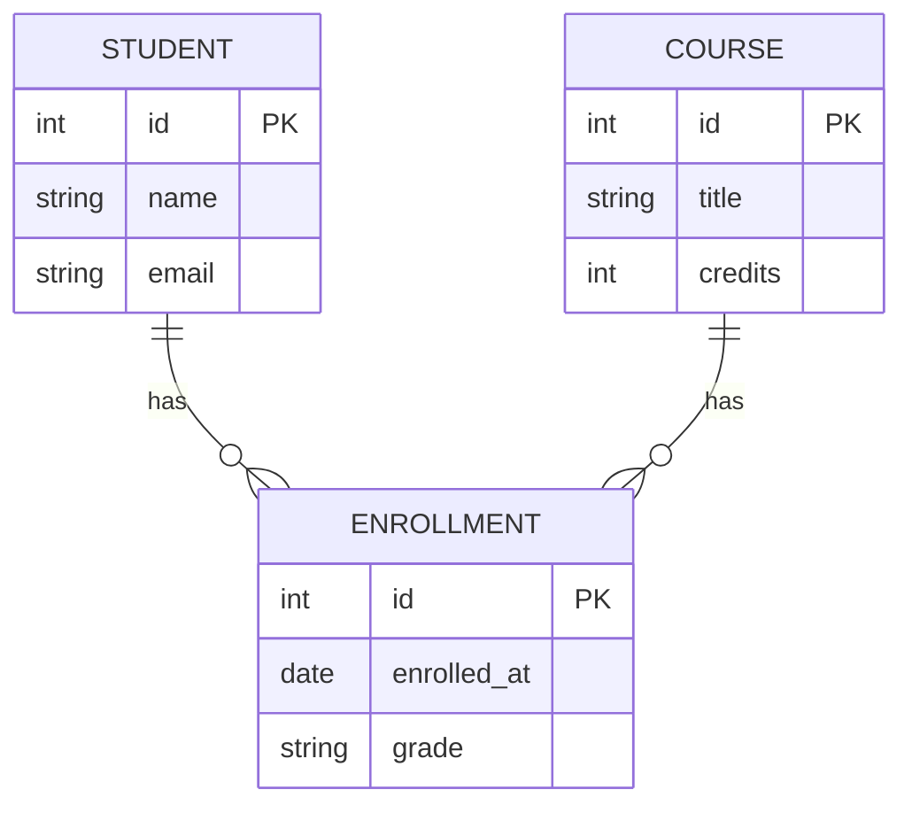

---

## Dotted and Thick Edges

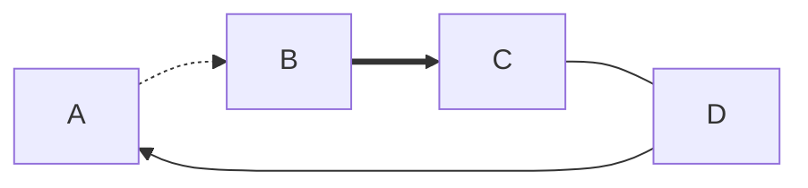

---

## Mixed Content

Some text before the diagram.

And some text after.
